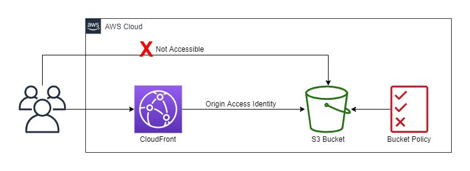

# 🌍 Global Clinical Trials Landing Page

This project enables secure, global reach for clinical trial recruitment using AWS services like S3 and CloudFront. It was designed with privacy, performance, and scalability in mind — ideal for reaching participants across Europe, Asia, North America, and Africa.

---

## 🩺 Project Context

The clinical trial for the XYZ drug requires global volunteer participation. With health data being sensitive and privacy-regulated, this project ensures global access without compromising privacy.

---

## 🧰 Technologies & Tools Used

- **HTML/CSS**: Static content for the landing page (`index.html`, `style.css`, images).
- **Amazon S3**: Used to store static assets securely (bucket access is fully restricted).
- **CloudFront**: Used as a CDN for global content delivery with **Origin Access Control (OAC)**.
- **AWS IAM & Bucket Policy**: Controlled access between CloudFront and the S3 bucket.
- **Regions Used**: Europe, Asia, North America, and Africa (configured in CloudFront).
- **Security**: HTTPS enforced, direct S3 access blocked, CloudFront-only access allowed.

---

## 🔐 Security Considerations

- Used **Origin Access Control (OAC)** to restrict access to the S3 bucket.
- Omitted advanced security layers (e.g., AWS WAF, logging) to keep the project focused.

---

## 🌐 Access Flow

1. User visits the CloudFront distribution URL.
2. CloudFront fetches the content from the S3 bucket via OAC.
3. S3 serves the content *only* through CloudFront — direct public access is blocked.



---

## 🚀 How to Run Locally

To test the landing page locally:
```bash
git clone https://github.com/baylon-obinna/HealthTech-Projects.git
cd CLINICAL-TRIALS
open index.html  # or use a browser to open the file
